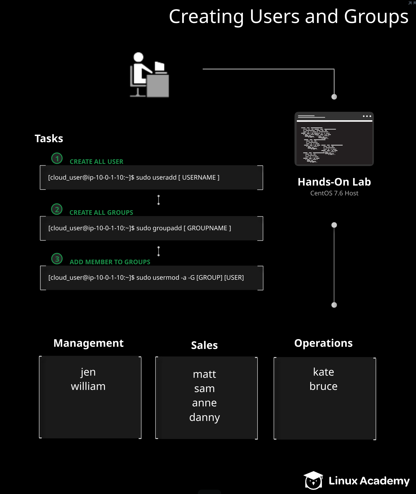

## Ansible-Challenges No.2 - Creating Users and Group from the Command Line using Ansible Playbook

## Create a Ansible Playbook to automate the process 

* The purpose of this challenges is to create a ansible playbook to do the following tasks

  

### Below is the task that execute using this ansible playbook:

1. Adding three group --> management, sales and operation
2. Adding jen and william to all three group --> management, sales and operation
3. Adding matt, sam, anne and danny to sales group 
4. Adding kate and bruce to operations group 
5. Verify the user have add to correct group and register in 'group_user_verification'
6. Print out the content in 'group_user_verification'
7. Delete all the user after printout
8. Delete all the group after printout

Further Reading:
 
* [ansible.builtin.group module](https://docs.ansible.com/ansible/latest/collections/ansible/builtin/group_module.html)
* [ansible.builtin.user module](https://docs.ansible.com/ansible/latest/collections/ansible/builtin/user_module.html)
* [ansible.builtin.shell module](https://docs.ansible.com/ansible/latest/collections/ansible/builtin/shell_module.html)
* [ansible.builtin.debug module](https://docs.ansible.com/ansible/latest/collections/ansible/builtin/debug_module.html)

