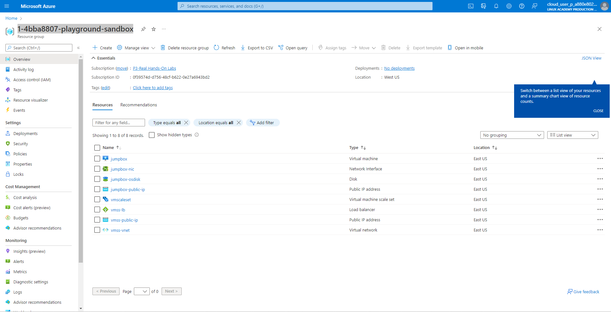

# Terraform Challenges No.1 - Create a VM Scale set using IaC on Azure #

### This challenges is using Terraform (IaC) to provision the vm with scale set 
[Create an Azure virtual machine scale set using Terraform](https://docs.microsoft.com/en-us/azure/developer/terraform/create-vm-scaleset-network-disks-hcl)

## Tools that require before we started: :white_check_mark:

* Linux Kernel (Ubuntu20.04),
* Azure Sandbox
* Azure CLI
* Terraform
* git

### Step To Follow: 

1. Clone the file from this git repository to your local machine
2. Start your Azure Sandbox (with existing resources group) or login to your Azure Account and create your own resources group.
3. Change the resources group name of your Azure account in variable.tf 
    > variable "resource_group_name" 
    >> default = "<your_resources_group_name>"
4. You can change the virtual machine Username and Password in variable.tf 
    > variable "admin_user"
    >> default = "<your_admin_user_name>"
    
    > variable "admin_password" 
    >> default = "<your_admin_password>"
5. Login to Azure Account ```az login -u <you_account_name>```
6. Use Terraform to set up the resources with `main.tf`, `variable.tf` & `output.tf` with the following comment: 
   * `terraform init`
   * `sudo bash -c "sed -i '/management.azure.com/d' /etc/hosts" ; sudo bash -c 'echo  "$(dig management.azure.com | grep -E -o "([0-9]{1,3}[\.]){3}[0-9]{1,3}$") management.azure.com" >> /etc/hosts'`
   * `terraform plan -out main.tfplan` 
   * `terraform apply main.tfplan`

7. After complete `terraform apply -auto-approve`, wait for 1-2 minute and press Refresh button to check the resources that add to Azure resources group.
<p align="center">
  

8. SKU and vm_size need to be the same. For this exercise,
Sizes that SKU can use: 
   > ["Standard_A0","Standard_B2ms","Standard_B2s","Standard_D1_v2","Standard_DS1","Standard_DS1_v2","Standard_DS2_v2","Standard_D2","Standard_D2_v3","Standard_D2s_v3","Standard_F2","Standard_F2s_v2"]

* Sizes that vm_size can use:
  > ["standard_b1ms","standard_b2ms","standard_b2s","standard_b1s","standard_a0","standard_d2","standard_d1_v2","standard_ds1","standard_ds1_v2","standard_a1_v2","standard_f2","standard_ds3_v2","standard_d2s_v3"]


9. Delete all the resources in resources group by using the terraform comment:
  * `terraform plan -destroy -out main.destroy.tfplan`
  * `terraform apply main.destroy.tfplan`

### Reference

* [Find Azure Marketplace image information using the Azure CLI](https://docs.microsoft.com/en-us/azure/virtual-machines/linux/cli-ps-findimage#list-popular-images)


    


