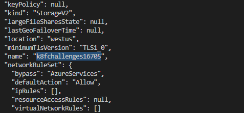
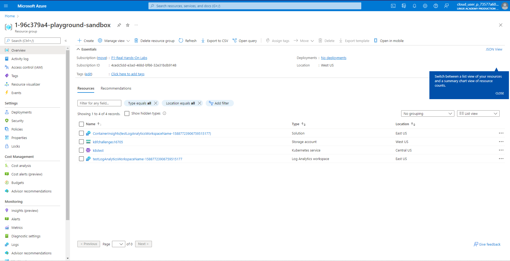
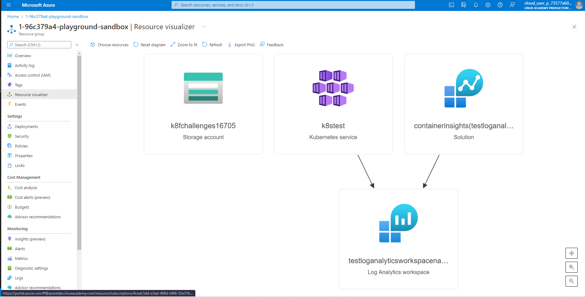

# Terraform Challenges No.2 - Create a Kubernetes cluster with Azure Kubernetes Services using IaC on Azure #

### This challenges is using Terraform (IaC) to provision the Kubernetes cluster with Azure Kubernetes Services
[Create a Kubernetes cluster with Azure Kubernetes Service using Terraform](https://docs.microsoft.com/en-us/azure/developer/terraform/create-k8s-cluster-with-tf-and-aks)

## Tools that require before we started: :white_check_mark:

* Linux Kernel (Ubuntu20.04),
* Azure Sandbox
* Azure CLI
* Terraform
* git

### Step To Follow: 
### Based on this (We are avoiding Storage and service principal)

1. Clone the file from this git repository to your local machine
2. Start your Azure Sandbox (with existing resources group) or login to your Azure Account and create your own resources group.
3. Change the resources group name of your Azure account in variable.tf and main.tf
    > variable "resource_group_name" 
    >> default = "<your_resources_group_name>"
4. Login to Azure Account ```az login -u <you_account_name>```
5. Define the storage account variable with the following command
```
 RESOURCE_GROUP_NAME="resource_group_name"
```
```
 STORAGE_ACCOUNT_NAME="k8fchallenges$RANDOM"
```
```
 CONTAINER_NAME='tfstate'
```
6. Create a storage account with the following command:
```
az storage account create --resource-group $RESOURCE_GROUP_NAME --name $STORAGE_ACCOUNT_NAME --sku Standard_LRS --encryption-services blob
```
> Note: Ammend the storage account name by get the name from the output of the above command to main.tf
<p align="center">
  


7. Create a blob container with the following command:
```
az storage container create --name $CONTAINER_NAME --account-name $STORAGE_ACCOUNT_NAME
```
8. Get the storage access key and store it as an environment variable with the following command:
```
ACCOUNT_KEY=$(az storage account keys list --resource-group $RESOURCE_GROUP_NAME --account-name $STORAGE_ACCOUNT_NAME --query '[0].value' -o tsv) 
```
```
env:ARM_ACCESS_KEY=$ACCOUNT_KEY
```
9. Use Terraform to set up the resources with `main.tf`, `variable.tf` & `output.tf` with the following comment: 
   * `terraform init`
   * `sudo bash -c "sed -i '/management.azure.com/d' /etc/hosts" ; sudo bash -c 'echo  "$(dig management.azure.com | grep -E -o "([0-9]{1,3}[\.]){3}[0-9]{1,3}$") management.azure.com" >> /etc/hosts'`
   * `terraform plan -out main.tfplan` 
   * `terraform apply main.tfplan`

10. After complete `terraform apply main.tfplan`, wait for 1-2 minute and press Refresh button to check the resources that add to Azure resources group.
<p align="center">
  

11.Refer to the following photo for the Resource visualizer
<p align="center">
  

12. Delete all the resources in resources group by using the terraform comment:
  * `terraform plan -destroy -out main.destroy.tfplan`
  * `terraform apply main.destroy.tfplan`

### Reference

* [Remote Backend State with Terraform and Azure Storage](https://www.youtube.com/watch?v=mpoTI660_Yg&t=429s)


    


