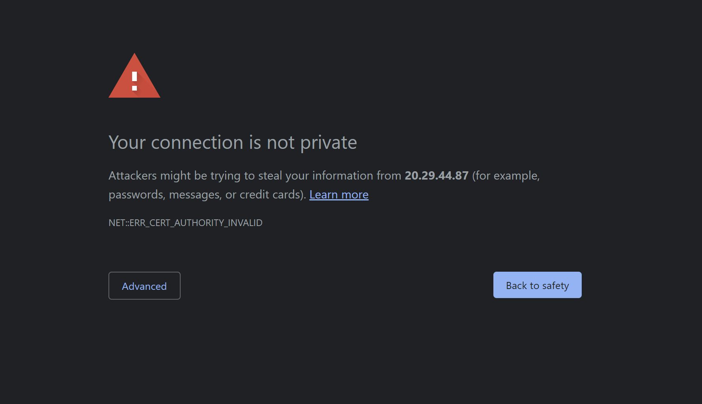

# gitlab challenges #

### This challenges is using Terraform and Ansible (IaC) to automate the [installation and configuration of GitLab on Microsoft Azure](https://docs.gitlab.com/ee/install/azure/)

## Tools that require before we started: :white_check_mark:

* Linux Kernel (Ubuntu20.04),
* Azure Sandbox,
* Azure CLI,
* Terraform,
* Ansible,
* [sshpass](https://installati.one/ubuntu/20.04/sshpass/)
* git

### Step To Follow: 

1. Clone the file from this git repository to your local machine
2. Start your Azure Sandbox (with existing resources group) or login to your Azure Account and create your own resources group.
3. Change the resources group name of your Azure account in variable.tf 
    > variable "resource_group_name" 
    >> default = "<your_resources_group_name>"
4. You can change the virtual machine Username and Password in variable.tf 
    > variable "admin_user"
    >> default = "<your_admin_user_name>"
    
    > variable "admin_password" 
    >> default = "<your_admin_password>"
5. Login to Azure Account ```az login -u <you_account_name>```
6. Use Terraform to set up the resources with `main.tf`, `variable.tf` & `output.tf` with the following comment: 
   * `terraform init`
   * `sudo bash -c "sed -i '/management.azure.com/d' /etc/hosts" ; sudo bash -c 'echo  "$(dig management.azure.com | grep -E -o "([0-9]{1,3}[\.]){3}[0-9]{1,3}$") management.azure.com" >> /etc/hosts'`
   * `terraform plan`
   * `terraform apply -auto-approve`
7. After complete `terraform apply -auto-approve`, wait for 1-2 minute and press Refresh button to check the resources that add to Azure resources group.
<p align="center">
  

8. Open the GitLab Webpage using the `public ip_address` or `DNS` in virtual machine (after the resources appear in Azure resources group), `take note that the connection is not secure and require to access the link by clicking advances setting`
<p align="center">
  

9. Wait for 2-4 minute after you click the link and you will see the page shown:
<p align="center">
  

10. Keep Refreshing until the webpage show with the image below as the image at the virtual machine require some time to configure and setup using the images that provided.
<p align="center">
  

11. Use Ansible to automate the file configuration with `main.yml` & the file `publicip` & `password` to get the GitLab username and Password and register SSL for the webpage with the following comment: 
```
  ansible-playbook main.yml -u <vm_admin_user_name> -e "{target:<vm_publicip>}" -k  -i <vm_publicip>,
```
<p align="center">
  

12. After Login, you may git push [(with ssh key set up)](https://docs.gitlab.com/ee/user/ssh.html) your repository to keep your file or code on GitLab.
<p align="center">
  

13. Delete all the resources in resources group by using the terraform comment:
    * `terraform init -auto-approve`

### Reference

* [Bitnami Application Credentials](https://docs.bitnami.com/azure/faq/get-started/find-credentials/)
* [Terraform Azurerm](https://registry.terraform.io/providers/hashicorp/azurerm/latest/docs/resources/network_security_group)
* [Terraform Local - Create local file](https://registry.terraform.io/providers/hashicorp/local/latest/docs/resources/file)
* [Ansibe Replace](https://www.middlewareinventory.com/blog/ansible-replace-line-in-file-ansible-replace-examples)
* [Automate Root Password Change using Ansible Playbook](https://www.thegeeksearch.com/automate-root-password-change-using-ansible-playbook/)
* [Brandon challenge-gitlab](https://github.com/vysky/challenge-gitlab)

### Note

* Terraform code was reference from the json code that exported from Azure Platform


    


