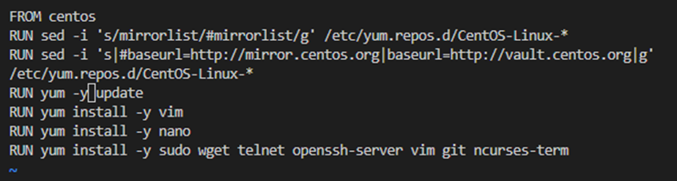

# Docker Challenges
## Centos - install another linux on your docker container

Make sure you have docker installed on your machine! if you have not, you should google on how to install it before reading the next few requirements:

1. Can you try to pull `centos` image from docker hub?

2. Then can you run centos via the terminal?
3. Check that it is centos. `cat /etc/os-release`
4. Check that it has nano, ssh and vim.
5. Can you install `top` in centOS?

If you do not have them, make sure you have vim, nano and other essential packages installed. At this point in time, you need to research on how to update your centos to have all of the above mentioned.

*********
Please refer to this [docker images](https://hub.docker.com/repository/docker/rickpoh95/dockerchallenge) to download the repository 

* I have create the images which include all the command for this challenges)

* docker build container with this images and the challenges is complete. 

  

Further reading: 

What's a docker image https://www.tutorialspoint.com/docker/docker_images.htm
What's a dockerfile: https://www.tutorialspoint.com/docker/docker_file.htm
Atop https://www.cyberciti.biz/faq/centos-redhat-linux-install-atop-command-using-yum/
Kubernetes vs docker https://www.geeksforgeeks.org/kubernetes-vs-docker/

