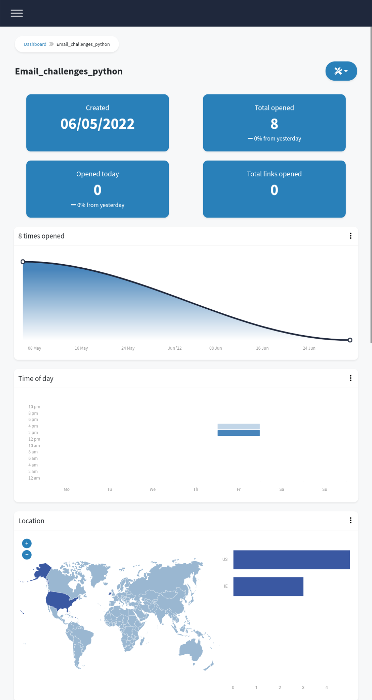

# Sent SMTP email with tracker

Yet another Email challenge. 

1. this time you should use the smtp library to send ytbryan@gmail.com an email with an attachment. 
You can easily find the solution on the internet. 

2. Bonus: Insert an invisible email tracking using one of those email tracking tools. 
Include a link to the tool that you used to track my clicking. You are probably using an invisible pixel.

Let me know if it works out. ie if you can detect that I have opened your email. :D 

Good luck! 

*******
IMPORTANT: You must remove your your username and password before sharing. Do not share your credential publicly.
*******
### Insert tracker to track the emails you send with Gmail to know when they are opened

* The following photo is the tracking from [pastepixel](https://pastepixel.com/ )

  

Further reading:

* [How to Track Email Opens & Clicks in Gmail](https://www.rightinbox.com/blog/email-tracking-gmail)
* [How to Set an Email Tracking Pixel](https://smallbusiness.chron.com/set-email-tracking-pixel-49332.html)
* [LIST OF THE 8 BEST EMAIL TRACKER APPS](https://sg.oberlo.com/blog/email-tracker)
* [Sending Emails With Python](https://realpython.com/python-send-email/#option-2-setting-up-a-local-smtp-server)
* [Send an email with attachment in Gmail using python](https://levelup.gitconnected.com/send-email-using-python-30fc1f203505)
* [Python Send Html, Image And Attachment Email Example](https://www.code-learner.com/python-send-html-image-and-attachment-email-example/)

