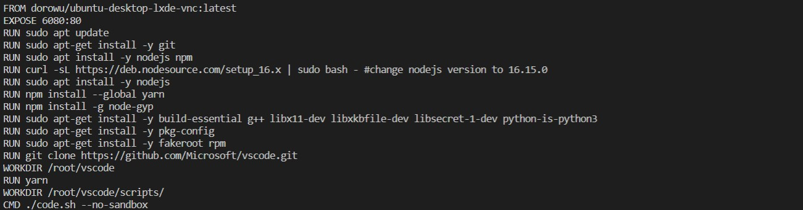
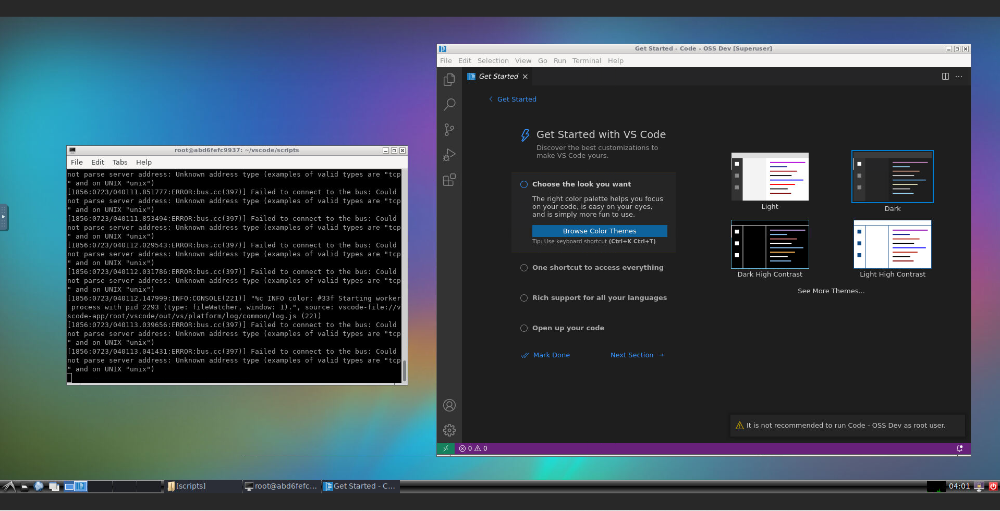

## Docker Ubuntu Desktop VS Code Installation
******
### Part 1: This challenge is to install Ubuntu Desktop on docker. 

There are many parts to this challenge. I'm releasing the first part only. 

https://hub.docker.com/r/dorowu/ubuntu-desktop-lxde-vnc/
https://github.com/fcwu/docker-ubuntu-vnc-desktop

Your task is to get ubuntu desktop running and share your steps and screenshot. (FYI, i tried it and it worked)

### Part 2: Install vscode in your ubuntu desktop.
NOTE: you need to clone the code and run it. 
Not go to ubuntu store and download the compiled vscode.

https://github.com/Microsoft/vscode
https://github.com/microsoft/vscode/wiki/How-to-Contribute

See how to run from source

* Hint1: Do all the dependencies have the correct version? For instance, do you know if the node version is correct?

* Hint2: https://github.com/microsoft/vscode/wiki/How-to-Contribute#vs-code-for-the-web

### Below is the docker command in the dockerfile of the challenges:

  

### Below is the ubuntu desktop with vs code install in docker container:

  

