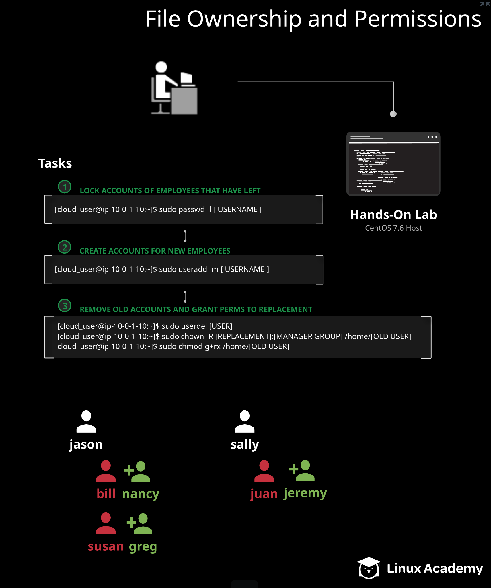

## Ansible-Challenges No.3 - Managing File Ownership and Permissions

## Create a Ansible Playbook to automate the following process 

* The purpose of this challenges is to create a ansible playbook to do the following tasks

  

### Below is the task that execute using this ansible playbook:

1. Add the variable of directory, lock_user, newuser and boss_level
2. Create user and group account with the variable (lock_user, newuser and boss_level)
3. Verify the directory is made with correct ownership assign
4. Lock user that left the company with the variable (lock_user)
5. Change the ownership of with complex loops (Iterating over nested lists)
   * bill directory to nancy and jason 
   * susan directory to greg and jason 
   * juan directory to jeremy and sally
6. Verify and print out the updated directory ownership for all three new user (nancy, greg and jeremy)
7. Check Nancy have write permission and create a line into add_file and print out the content of the file.
8. Delete the user and group account after the testing, ignore the user account that been lock
9. Make sure all the document delete properly by cat out the content at home directory
10. Check and print out the content if users and groups still exists in etc/group and etc /passwd file.

### Command to execute the ansible playbook
* sudo ansible-playbook <name_of_the_playnook.yml>
* Remember to change the sudo password at ansible_become_pass

Further Reading:
 
* [ansible.builtin.group module](https://docs.ansible.com/ansible/latest/collections/ansible/builtin/group_module.html)
* [ansible.builtin.user module](https://docs.ansible.com/ansible/latest/collections/ansible/builtin/user_module.html)
* [ansible.builtin.file module](https://docs.ansible.com/ansible/latest/collections/ansible/builtin/file_module.html)
* [Loops](https://docs.ansible.com/ansible/latest/user_guide/playbooks_loops.html#loops)
* [ansible.builtin.shell module](https://docs.ansible.com/ansible/latest/collections/ansible/builtin/shell_module.html)
* [ansible.builtin.lineinfile](https://docs.ansible.com/ansible/latest/collections/ansible/builtin/lineinfile_module.html)

